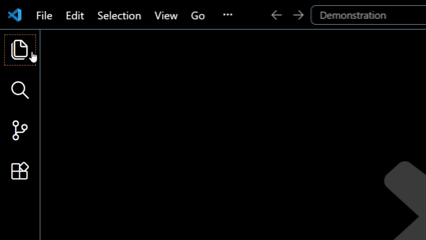

## Folder Expo
Explorer UI based VS Code Extension for quickly switching between folders.

## Video Demonstration

### Saving & Loading a new Folder (Older Version Demo)

<!--
[TO DO:]
	Shoot an updated demo video when you get the chance!

### New Functionality (Version: 0.1.0+ )

-->

## Why I created this
	I like to have extensions within the Explorer View & I find project manager's to be helpful.
	There does not appear to be a similar extension on the marketplace (that I can find), so I made my own.
